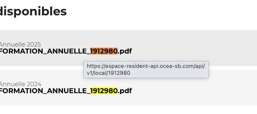
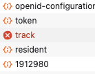

# Ocea Smart Building - Home Assistant Integration

[](https://github.com/hacs/integration)

Intégration Home Assistant pour récupérer la consommation d'eau froide et chaude depuis l'espace résident [Ocea Smart Building](https://espace-resident.ocea-sb.com).

## Fonctionnalités

- **Eau froide** : consommation totale en m³
- **Eau chaude** : consommation totale en m³
- Compatible **tableau de bord Énergie** (section eau)
- Authentification Azure AD B2C automatique (pas de navigateur headless)
- Rafraîchissement automatique du token
- Configuration via l'UI

## Installation

### Via HACS (recommandé)

1. HACS → Intégrations → ⋮ → Dépôts personnalisés
2. Ajouter l'URL du dépôt, catégorie **Intégration**
3. Chercher "Ocea Smart Building" → Installer
4. Redémarrer Home Assistant

### Manuelle

Copier `custom_components/ocea_smart_building/` dans `config/custom_components/` puis redémarrer.

## Configuration

Paramètres → Appareils et services → Ajouter → "Ocea Smart Building"

- **Email** : votre email de connexion à l'espace résident Ocea
- **Mot de passe** : votre mot de passe Ocea
- **Identifiant du local** : un numéro unique qui identifie votre logement chez Ocea (voir ci-dessous)

### Comment trouver l'identifiant du local

Ce numéro identifie votre logement chez Ocea. Il y a deux façons de le trouver :

#### Méthode 1 — Via vos documents (la plus simple)

Connectez-vous sur [espace-resident.ocea-sb.com](https://espace-resident.ocea-sb.com) et allez dans la section **Documents**. Vos documents annuels contiennent l'identifiant dans leur nom de fichier, et le lien de téléchargement contient aussi `/local/VOTRE_ID` :



#### Méthode 2 — Via les outils développeur

1. Ouvrez les outils développeur de votre navigateur (`F12` ou `Cmd + Option + I` sur Mac)
2. Cliquez sur l'onglet **Network** (Réseau)
3. Connectez-vous sur [espace-resident.ocea-sb.com](https://espace-resident.ocea-sb.com)
4. Dans la liste des requêtes, repérez celles qui contiennent un **nombre** — c'est votre identifiant



C'est ce nombre qu'il faut renseigner dans la configuration de l'intégration.

## Tableau de bord Énergie

Les sensors sont directement sélectionnables dans Paramètres → Tableaux de bord → Énergie → Consommation d'eau.

## Dépannage

```yaml
logger:
  logs:
    custom_components.ocea_smart_building: debug
```